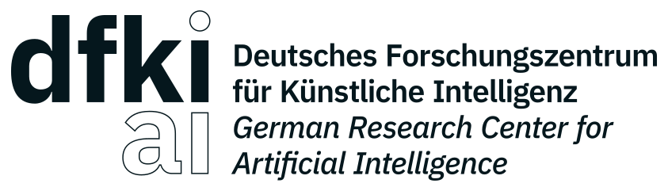

# Contributing to better_launch
Please inform the maintainer as early as possible about your planned
feature developments, extensions, or bugfixes that you are working on.
An easy way is to open an issue or a pull request in which you explain
what you are trying to do.

## Pull Requests
The preferred way to contribute to *better_launch* is to fork the
[main repository](https://github.com/dfki-ric/better_launch) on GitHub, then submit a "pull request"
(PR):

1. [Create an account](https://github.com/signup/free) on
   GitHub if you do not already have one.

2. Fork the [project repository](https://github.com/dfki-ric/better_launch):
   click on the 'Fork' button near the top of the page. This creates a copy of
   the code under your account on the GitHub server.

3. Clone this copy to your local disk:

        $ git clone git@github.com:dfki-rc/better_launch.git

4. Create a branch to hold your changes:

        $ git checkout -b my-feature

    and start making changes. Never work in the ``master`` branch!

5. Work on this copy, on your computer, using Git to do the version
   control. When you're done editing, do::

        $ git add modified_files
        $ git commit

    to record your changes in Git, then push them to GitHub with::

       $ git push -u origin my-feature

Finally, go to the web page of the your fork of the bolero repo,
and click 'Pull request' to send your changes to the maintainers for review.
request.

## Merge Policy
Developers have to submit pull requests. Those will be reviewed by at least
one other developer and merged by the maintainer. New features must be
documented and tested. Breaking changes must be discussed and announced
in advance with deprecation warnings.

## Roadmap
Who knows :)

## Funding
*better_launch* was initiated and is currently developed at the [Robotics Innovation Center](http://robotik.dfki-bremen.de/en/startpage.html) of the [German Research Center for Artificial Intelligence (DFKI)](http://www.dfki.de) in Bremen.

