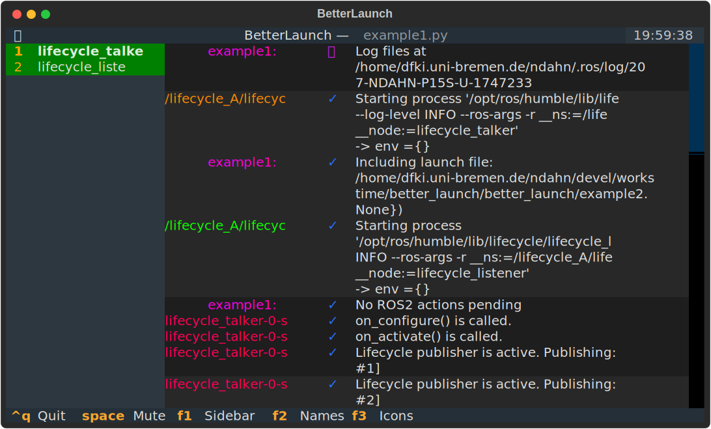

# About
Let's face it: ROS2 has been a severe downgrade in terms of usability compared to ROS1. While there are many considerable improvements, the current launch system is borderline unusable. I've listed my personal gripes below, but if you're here you likely feel the same. This is why I wrote ***better_launch***.


# So what does it look like?
Like this! 

```python
from better_launch import BetterLaunch, launch_this, LifecycleStage

@launch_this
def test(enable_x: bool):
    """
    This is how nice your launch files could be!
    """
    bl = BetterLaunch()

    if enable_x:
        bl.node(
            "examples_rclpy_minimal_publisher",
            "publisher_local_function",
            "TestNode",
        )

    with bl.group("text"):
        with bl.compose("MyComposer"):
            bl.component("composition", "composition::Talker", "CompTalker")
            bl.component("composition", "composition::Listener", "CompListener")

        bl.include("my_other_launchfile.py", "my_other_package")
```

And because I apparently have too much free time, there is also a terminal UI reminiscent of the much missed [rosmon](https://github.com/xqms/rosmon). But wait, there is more: because the UI is based on [textual](https://textual.textualize.io/) you can even serve it as an interactive website!



**TODO link to documentation**


# Why not improve the existing ROS2 launch?
Because I think it is beyond redemption and no amount of refactoring and REPs (ROS enhancement proposal) will turn the sails. Tools like the highly rated [simple_launch](https://github.com/oKermorgant/simple_launch) exist, but still use ROS2 launch under the hood and so inherit much of its clunkiness. Rather than fixing an inherently broken solution, I decided to make a RAP - a ROS abandonment proposal :)

Essentially, *better_launch* is what I wish ROS2 launch would be: comfortable to use, simple to understand, easy to remember. This is why *better_launch* is **not** yet another abstraction layer over ROS2 launch; it is a **full** replacement with no imports or dependencies on the existing launch system.


# Okay, what are the differences?
Because *better_launch* does not use the ROS2 launch system, some aspects work different from what you may be used to. 


### Action immediacy
In ROS2 launch, launch files create tasks that are then passed as a single batch to an asynchronous event loop. This makes e.g. having conditions on arguments so incredibly weird. In *better_launch* however, all actions are taken immediately: if you create a node, its process is started right away; if you include another *better_launch* launch file, its contents will be handled before the function returns. 

The only exception to this is adding ROS2 actions, which includes including regular ROS2 launch files. Since they still rely on the ROS2 launch system, they need to be turned into proper ROS2 tasks and passed to the asynchronous event loop. Usually the ROS2 launch service process is started immediately the first time a ROS2 action is passed to *better_launch*, and from then on will handle all passed actions asynchronously in the background.


### Type checking
When passing arguments to a node in ROS2, in the end everything is passed as stringified command line arguments. So why bother with types? *better_launch* does not enforce overly strict type checking on you and will happily accept *int*, *string*, *float*, etc. for any given argument. In addition, sensible and *unsurprising* types have been chosen for all arguments you may provide.


### Declaring launch arguments
Simply put: you don't. *better_launch* will check the signature of your launch function and turn all arguments into launch arguments. For example, if your launch function has an `enable_x` argument, you will be able to pass it with `--enable_x` on the command line. Under the hood, *better_launch* is using [click](https://click.palletsprojects.com/), so every launch file you write comes with proper argument listing. 

Special tip: add a docstring to your function and call your launch file with `--help`!


### Logging
Just like ROS2 launch, *better_launch* takes care of managing loggers and redirecting everything where it belongs (in fact that part is straight up copied from ROS2 launch). However, I also added a thin parsing and formatting layer so that colors and nicer screen output are possible. This can be turned off of course by setting the `reparse_logs` option when creating nodes.


### Abandoned processes
ROS2 launch has a bad reputation of leaving stale and abandoned processes behind after terminating. In my testing so far this has never been an issue with *better_launch* yet - except when you hard kill (-9) its process.


# What doesn't work yet
As of now *better_launch* supports the most important use cases, like starting nodes, proper (nicer!) logging, being awesome. However, there are still a couple of features that I have to work on to make it feature complete (roughly sorted by priority):
- [ ] TUI does not show log output from ROS2 launch service
- [ ] document public API
- [ ] exception handling is barebones, so if something fails, everything fails
- [ ] better yaml param loader (it's already nice, but could be nicer)
- [ ] the TUI is fast, but could maybe be even faster
- [ ] check how well it handles high-volume logging
- [ ] check for edge cases
- [ ] the TUI can miss some log messages and I'm not sure why. If in doubt, check without the TUI!


# What's so bad about ROS2 launch?
Here is a "simple" launch file from the official documentation that does nothing but include another launch file:

```python
from launch_ros.substitutions import FindPackageShare

from launch import LaunchDescription
from launch.actions import IncludeLaunchDescription
from launch.launch_description_sources import PythonLaunchDescriptionSource
from launch.substitutions import PathJoinSubstitution, TextSubstitution


def generate_launch_description():
    return LaunchDescription([
        IncludeLaunchDescription(
            PythonLaunchDescriptionSource([
                PathJoinSubstitution([
                    FindPackageShare('launch_tutorial'),
                    'launch',
                    'example_substitutions.launch.py'
                ])
            ]),
            launch_arguments={
                'turtlesim_ns': 'turtlesim2',
                'use_provided_red': 'True',
                'new_background_r': TextSubstitution(text=str('200'))
            }.items()
        )
    ])
```

I think we can agree that this is not exactly elegant - including another launch file should be doable within a single line, not 10 plus 5 imports. Other terrible decisions within ROS2 launch include, but are not limited to:
- a weird fetish for import statements (see above)
- unneccesarily strict type checking (why use python if I have to verify everything?)
- nonsensical argument types (e.g. remaps are a *list of tuples* instead of simply a *dict*)
- using asyncio may be slightly faster, but prevents using readily available launch arguments (ever wondered why there is no `if my_arg: launch_node()`?)
- horrendous API for starting lifecycle nodes (also, why the hell are there two completely separate base interfaces?)
- and the list goes on...
